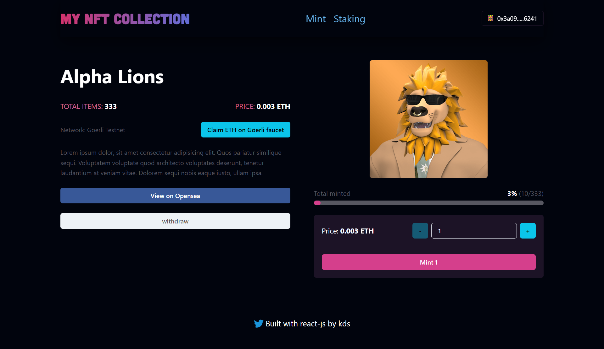
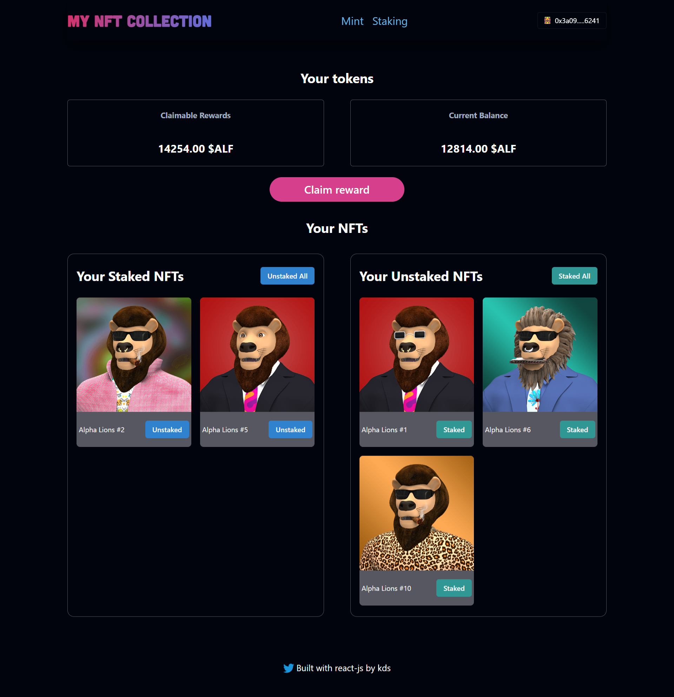

# NFT-Mint-Staking-DApp

[](https://twitter.com/kds_JS)

[](https://twitter.com/kds_JS)

### Smart Contract, page de mint et page de staking d'une collection NFT
### Le Smart Contract a été deployé sur le reseau:  <b>Göerli Testnet</b>
#### Le site est responsive

## Tâches
 - [x] Mint un NFT (ERC721A)
 - [x] Stake un NFT
 - [x] Unstake un NFT
 - [x] Reclamer les rewards (token ERC20)
 - [x] Voir ses NFTs sur Opensea
 - [x] Voir ses Tokens sur Metamask
 

## [LIVE ICI](https://nft-mint-staking-dapp.vercel.app/)

## Technologies utilisés 
 - Solidity
 - Hardhat
 - Ethers JS
 - React
 - Chakra UI

### Installation

1. Cloner le repo github
   ```sh
   https://github.com/Kds-JS/NFT-Mint-Staking-Dapp.git
   ```
2. Installer les dépendances
   ```sh
   npm install
   ```
3. Lancer l'application
   ```sh
   npm start
   ```


# Sample Hardhat Project

This project demonstrates a basic Hardhat use case. It comes with a sample contract, a test for that contract, and a script that deploys that contract.

Try running some of the following tasks:

```shell
npx hardhat help
npx hardhat test
REPORT_GAS=true npx hardhat test
npx hardhat node
npx hardhat run scripts/deploy.js
```

## Contact

Kds - [@twitter](https://twitter.com/kds_JS) 

Lien du Projet: [https://github.com/Kds-JS/NFT-Mint-Staking-Dapp.git])
